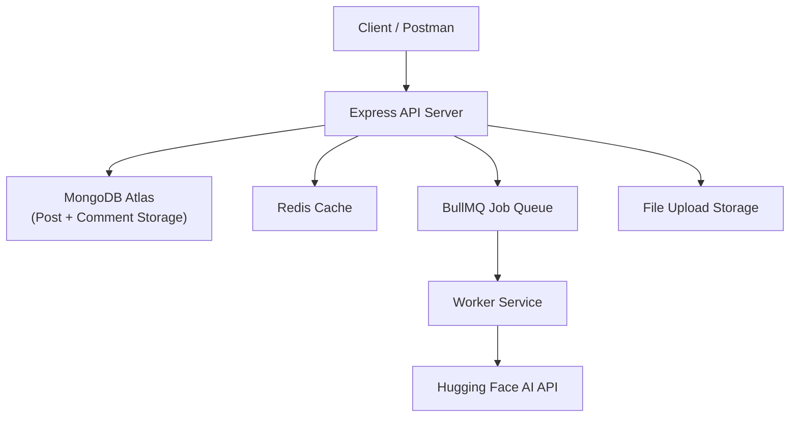
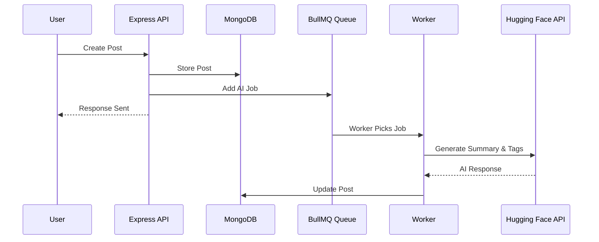
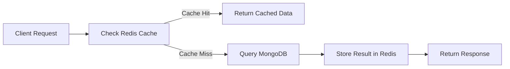

# 🚀 InsightCore — AI-Powered Knowledge Sharing Backend 
A backend-first knowledge sharing platform built using **Node.js**, **MongoDB**, **Redis**, and **AI APIs** that demonstrates real-world scalable backend architecture.

InsightCore allows users to create posts, discuss ideas, vote on content, and discover knowledge using AI-powered summaries and advanced search.

This system showcases modern backend engineering practices including async processing, Redis caching, job queues, and AI integration.

✔ JWT Authentication
✔ AI Generated Summaries & Tags
✔ Advanced Search using MongoDB Atlas
✔ Redis Caching Layer
✔ BullMQ Background Workers
✔ Nested Comments System
✔ Voting System
✔ Scalable API Design

This project focuses on real backend architecture, performance optimization, and scalable API systems.

---

# 📑 Table of Contents
✔ Key Features
✔ System Architecture
✔ Tech Stack
✔ Redis Data Modeling
✔ Project Structure
✔ Setup & Installation
✔ Environment Variable
✔ Running The Project
✔ API Documentation
✔ Feature Deep-Dive (with diagrams)
✔ Postman Testing (Screenshots)
✔ Error Handling & Edge Cases
✔ Security Practices
✔ Performance & Scalability
✔ Real-World Use Cases
✔ Learning Outcomes
✔ Future Enhancements
✔ Credits

---

# 🧠 About The Project
Modern platforms like Reddit, StackOverflow, and Medium are not simple CRUD applications. They require scalable backend systems capable of handling content generation, asynchronous AI processing, caching, and search optimization.

InsightCore was built to simulate such a system.

It demonstrates how a backend can:
- process content asynchronously using workers
- generate AI summaries
- cache frequently accessed data
- support threaded discussions
- provide intelligent search

The architecture separates API processing, background jobs, caching, and search indexing to ensure high performance and scalability.

---

# ⭐ Key Features
**User Authentication & Roles**
✔ JWT-based authentication
✔ Role-based access control
✔ Roles: User, Moderator, Admin

**Post Management**
✔ Create, update, delete posts
✔ Upload images using Multer
✔ AI-generated summaries and tags

**Comments & Replies**
✔ Nested comment system
✔ Threaded replies
✔ Soft delete support

**Voting System**
✔ Upvote/downvote posts
✔ Like comments

**AI Integration**
✔ Automatic content summarization
✔ Auto tag generation using Hugging Face models

**Advanced Search**
✔ MongoDB Atlas Search
✔ Relevance ranking
✔ Field boosting
✔ Pagination

*Performance Optimization*
✔ Redis caching
✔ Background processing using BullMQ

---

# 🏗 System Architecture

This architecture ensures:
 ->Fast API responses
 ->Non-blocking AI processing
 ->Scalable data access
 ->Efficient caching

# 🧠 AI Summarization Flow
When a user creates a post, the AI system automatically generates summaries and tags.


This ensures AI processing does not slow down API responses.

# ⚡ Redis Caching Flow
Redis is used to cache frequently requested resources like posts and comments.


This reduces database load and improves response speed.

# 🔎 Advanced Search Flow
Search functionality is powered by MongoDB Atlas Search.


The search system supports:
 ->Relevance scoring
 ->Text highlights
 ->Pagination
 ->Field boosting

---

# Tech Stack
| Layer          | Tool                 |
| -------------- | -------------------- |
| Runtime        | Node.js              |
| Framework      | Express.js           |
| Database       | MongoDB Atlas        |
| Cache          | Redis                |
| Queue          | BullMQ               |
| AI Integration | Hugging Face API     |
| File Upload    | Multer               |
| Search Engine  | MongoDB Atlas Search |
| Authentication | JWT                  |
| Testing        | Postman              |
---

# 🗄 Redis Data Modeling
Redis stores cached responses to reduce database queries.

**Purpose**	
 -Key Pattern

**Posts Cache**	    
 -posts:allPosts:page:<page>:limit:<limit>

**Single Post**
 -post:<postId>

**Comments**
 -comments:post:<postId>:page:<page>

Cache invalidation occurs when:
 ->Post created
 ->Post updated
 ->Post deleted
 ->Votes change
 ->Comments added
TTL ensures stale data automatically expires.

---

# 📂 Project Structure
InsightCore/

controllers/
models/
routes/
middlewares/
services/
queues/
workers/
configs/
uploads/

app.js
server.js
README.md

🧠 Why this structure?
✔ Clean architecture
✔ Separation of concerns
✔ Maintainable codebase
✔ Scalable backend design

---

# ⚙️ Setup & Installation

```bash
git clone https://github.com/yourusername/InsightCore.git
cd InsightCore
npm install
```
---

# 🌱 Environment Variables
Create a .env file:
 PORT=5000

 MONGODB_URI=your_mongodb_connection

 JWT_SECRET=your_secret_key

 REDIS_HOST=your_redis_host
 REDIS_PORT=your_redis_port
 REDIS_USERNAME=default
 REDIS_PASSWORD=your_password

 HF_API_KEY=your_huggingface_api_key

 ⚠ Never commit .env files to GitHub.

---

# ▶ Running The Project
The easiest way to run the project is using Docker.

Start all services using:
**docker-compose up -d**

This command will start:

- Node.js API server
- MongoDB
- Redis
- Background worker

The services will run in detached mode.

To view logs:
**docker-compose logs -f**

To stop the project:
**docker-compose down**

---

# 📡 API Documentation
**Authentication**
POST /auth/register
POST /auth/login

**Posts**
POST /posts
GET /posts
GET /posts/:id
PATCH /posts/:id
DELETE /posts/:id

**Comments**
POST /comments/:postId
POST /comments/reply/:commentId
GET /comments/get-comments/:postId

**Search**
GET /posts/search?q=node&page=1

---

# 🔍 Feature Deep-Dive
**AI Integration**
 -Hugging Face API generates summaries
 -Automatic tag extraction
 -Processed asynchronously via workers

**Redis Caching**
Used for frequently accessed endpoints:
 -post feeds
 -individual posts
 -comment threads

**BullMQ Background Jobs**
Used for:
 -AI processing
 -heavy computation
 -async tasks

---

# 🧪 Postman Testing (Screenshots)
Example tested scenarios:

1.Creating posts with images

2.AI-generated summaries

3.Nested comment threads

4.Voting system

5.Search results

---

# ⚠ Error Handling & Edge Cases
Handled cases include:
 -Invalid ObjectIDs
 -Missing request parameters
 -Unauthorized access
 -Duplicate voting attempts
 -Invalid file uploads

All responses return structured error messages.

---

# 🔐 Security Practices
✔ JWT authentication
✔ Role-based access control
✔ Environment variable protection
✔ Input validation
✔ File upload restrictions

---

# ⚡ Performance & Scalability
**Key optimizations implemented:**
✔ Redis caching for frequent queries
✔ Background job processing
✔ Search indexing
✔ Pagination for large datasets
✔ Lean MongoDB queries

These ensure the backend scales efficiently as data grows.

---

# 🌎 Real-World Use Cases
**InsightCore architecture can power:**
✔ Developer communities
✔ Knowledge sharing platforms
✔ Educational forums
✔ AI-powered documentation systems
✔ Internal company knowledge bases

---

# 📚 Learning Outcomes
**Through this project I gained experience with:**
✔ Backend system architecture
✔ Redis caching strategies
✔ Asynchronous job processing
✔ MongoDB Atlas Search
✔ AI API integration
✔ Secure API development
✔ Scalable Node.js applications

---

# 🔮 Future Enhancements
✔ Real-time notifications
✔ Recommendation system
✔ AI toxicity detection
✔ Advanced moderation tools
✔ React frontend
✔ Docker deployment
✔ Cloud storage (S3✔  / GCS)

---

# 🙌 Credits
This project was designed and implemented independently to practice modern backend architecture using **Node.js, Redis, and AI services**.

Special thanks to:
✔ MongoDB documentation
✔ Redis community resources
✔ Hugging Face API
✔ Node.js ecosystem

Built for improving backend engineering and system design skills.

**License**

This project is licensed under the MIT License.

See the LICENSE.md file for details.